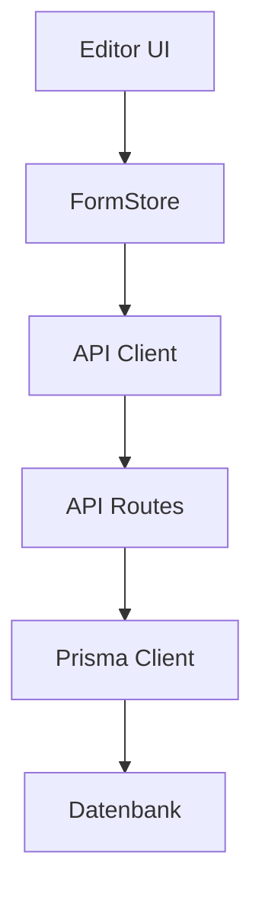
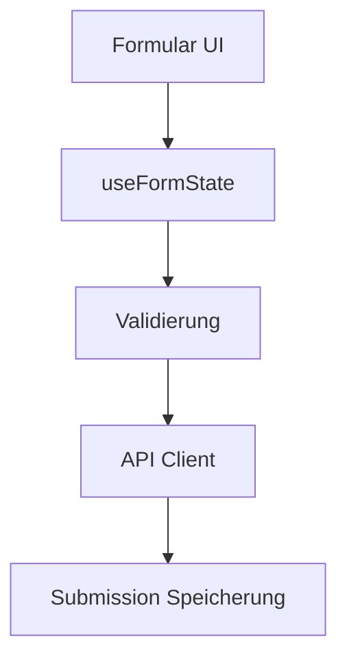

# Formilon - Technische Dokumentation

## Architektur-Übersicht

Die Anwendung ist als moderne Next.js-Webanwendung aufgebaut und folgt einer modularen, komponentenbasierten Architektur. Die Hauptverzeichnisstruktur unter `/src` ist wie folgt organisiert:

```
src/
├── components/     # Wiederverwendbare UI-Komponenten
├── hooks/         # Custom React Hooks
├── lib/          # Grundlegende Bibliotheken und Konfigurationen
├── pages/        # Next.js Seiten und API-Routen
├── store/        # Zustand-Management (Zustand)
├── styles/       # Globale Styles und Theming
├── types/        # TypeScript Typdefinitionen
├── utils/        # Hilfsfunktionen
└── middleware.ts # Next.js Middleware für Authentifizierung
```

## Kernkomponenten

### 1. Komponenten-Bibliothek (`/components`)

#### Formular-Komponenten

- `forms/QuestionCard.tsx`: Basis-Komponente für Fragedarstellung
- `forms/questions/`: Verschiedene Fragetyp-Komponenten
  - `ShortTextQuestion.tsx`: Kurztextfragen
  - `RatingQuestion.tsx`: Bewertungsfragen
  - `LinearScaleQuestion.tsx`: Lineare Skala-Fragen

#### Ergebnis-Visualisierungen

- `results/visualizations/`: Datenvisualisierungs-Komponenten
  - `RatingChart.tsx`: Diagramme für Bewertungen
  - `EmojiGrid.tsx`: Emoji-basierte Visualisierungen

#### Layout-Komponenten

- `Layout/`: Grundlegende Layout-Strukturen
  - `Header.tsx`: Navigation und Benutzer-Menü
  - `Sidebar.tsx`: Seitennavigation
  - `Footer.tsx`: Fußzeile

### 2. Custom Hooks (`/hooks`)

- `useFormState.ts`: Verwaltung des Formularzustands

  ```typescript
  const useFormState = (formId: string) => {
    // Verwaltet den Zustand eines Formulars während der Bearbeitung
    // Behandelt Änderungen, Validierung und Speicherung
  };
  ```

- `useQuestionOptions.ts`: Frageoptionen-Verwaltung

  ```typescript
  const useQuestionOptions = (questionType: QuestionType) => {
    // Liefert verfügbare Optionen basierend auf dem Fragetyp
    // Handhabt Validierung und Formatierung
  };
  ```

- `useResultsAnalytics.ts`: Analyse-Funktionalitäten
  ```typescript
  const useResultsAnalytics = (formId: string) => {
    // Berechnet Statistiken und bereitet Daten für Visualisierungen vor
  };
  ```

### 3. Bibliotheken und Konfigurationen (`/lib`)

- `prisma.ts`: Prisma Client Konfiguration
- `auth.ts`: NextAuth.js Konfiguration
- `api.ts`: Axios-Instanz und API-Hilfsfunktionen

### 4. Seiten und API-Routen (`/pages`)

#### Frontend-Seiten

- `pages/index.tsx`: Dashboard
- `pages/f/[id]/`: Formular-Editor
- `pages/s/[id]/`: Formular-Vorschau
- `pages/f/[id]/results/`: Ergebnis-Dashboard

#### API-Routen

- `pages/api/forms/`: CRUD-Operationen für Formulare
- `pages/api/forms/[id]/translate.ts`: Übersetzungs-Endpunkt
- `pages/api/auth/`: Authentifizierungs-Endpunkte

### 5. Zustandsverwaltung (`/store`)

Verwendet Zustand für clientseitiges State Management:

```typescript
interface FormStore {
  currentForm: Form | null;
  questions: Question[];
  setForm: (form: Form) => void;
  addQuestion: (question: Question) => void;
  updateQuestion: (id: string, updates: Partial<Question>) => void;
}
```

### 6. TypeScript Typen (`/types`)

Zentrale Typdefinitionen:

```typescript
interface Form {
  id: string;
  title: string;
  description?: string;
  published: boolean;
  customSlug?: string;
  welcomeScreen?: WelcomeScreen;
  thankyouScreen?: ThankYouScreen;
  theme?: FormTheme;
  questions: Question[];
}

interface Question {
  id: string;
  type: QuestionType;
  title: string;
  description?: string;
  required: boolean;
  properties: QuestionProperties;
}
```

## Datenfluss und Architektur-Patterns

### 1. Formular-Erstellung und -Bearbeitung



### 2. Formular-Beantwortung



## Wichtige Implementierungsdetails

### 1. Authentifizierung und Autorisierung

Die Middleware (`middleware.ts`) handhabt:

- Sitzungsverwaltung
- Routenschutz
- API-Authentifizierung

### 2. Internationalisierung

- Unterstützung für mehrere Sprachen
- Dynamische Übersetzungen via Google Translate API
- Lokalisierte UI-Komponenten

### 3. Formular-Logik

- Dynamische Fragetypen
- Konditionale Logik
- Echtzeit-Validierung

### 4. Datenvisualisierung

- Chartjs für Diagramme
- D3.js für komplexe Visualisierungen
- Recharts für responsive Grafiken

## Best Practices und Konventionen

### 1. Komponenten-Struktur

```typescript
// Beispiel einer Komponenten-Struktur
interface ComponentProps {
  // Props-Definition
}

const Component: React.FC<ComponentProps> = ({ prop1, prop2 }) => {
  // Komponenten-Logik
  return (
    // JSX
  );
};
```

### 2. Hook-Konventionen

- Prefix `use` für alle Hooks
- Einzelverantwortlichkeit
- Wiederverwendbare Logik

### 3. API-Struktur

```typescript
// API Route Struktur
export default async function handler(
  req: NextApiRequest,
  res: NextApiResponse
) {
  try {
    // Validierung
    // Geschäftslogik
    // Datenbank-Operationen
  } catch (error) {
    // Fehlerbehandlung
  }
}
```

## Entwicklungs-Workflows

### 1. Neue Funktionen hinzufügen

1. Types definieren
2. API-Endpunkte erstellen
3. Store aktualisieren
4. UI-Komponenten implementieren
5. Tests schreiben

### 2. Debugging

- Chrome DevTools für Frontend
- Prisma Studio für Datenbank
- Next.js Debug Mode

## Performance-Optimierungen

1. **Frontend**

   - Komponenten-Memoization
   - Lazy Loading
   - Image Optimization

2. **Backend**
   - API Route Caching
   - Datenbankindizes
   - Query Optimierung

## Sicherheitsmaßnahmen

1. **Authentifizierung**

   - JWT-Token Validierung
   - CSRF-Schutz
   - Rate Limiting

2. **Datenschutz**
   - Datenvalidierung
   - XSS-Prävention
   - SQL-Injection-Schutz

## Erweiterbarkeit

Die Architektur ermöglicht einfache Erweiterungen durch:

- Modulare Komponenten
- Abstrakte Interfaces
- Erweiterbare Store-Struktur
- Plugin-System für neue Fragetypen
